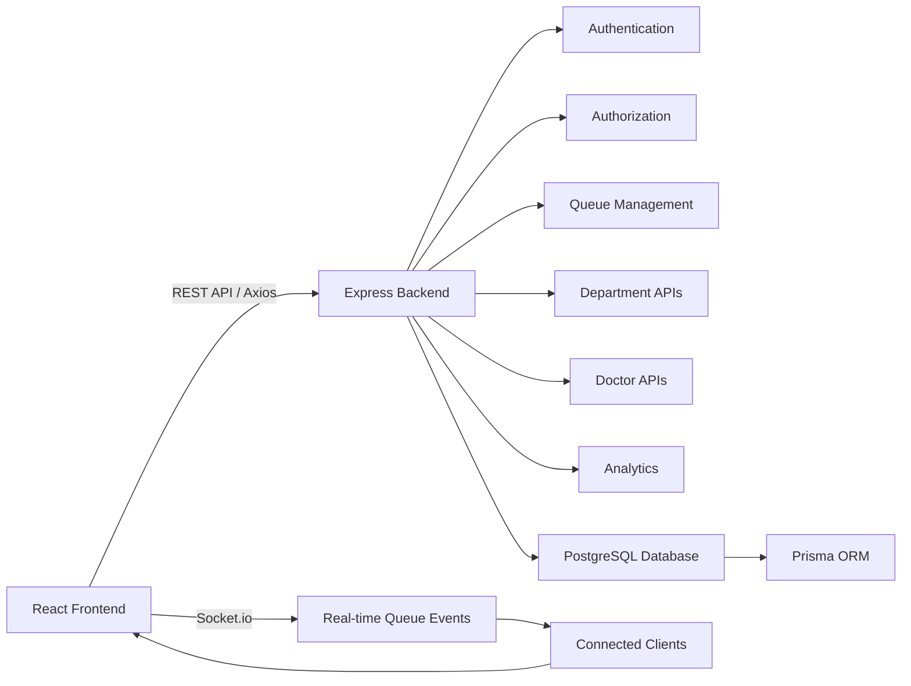
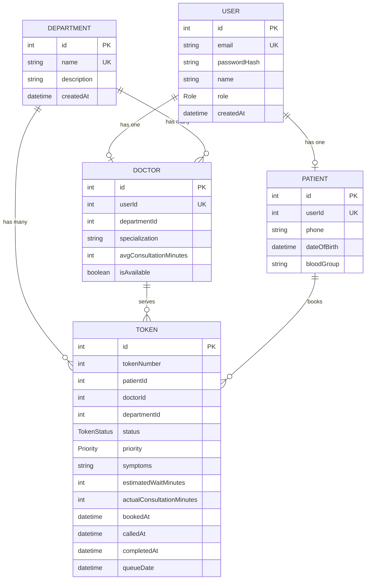
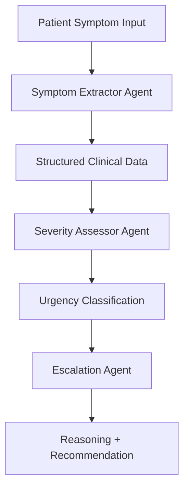

# Hospital Queue Management System

A full-stack hospital queue management platform designed to digitize patient flow, streamline doctor workflows, and provide real-time visibility into queue activity across hospital departments.

The system provides dedicated workflows for patients, doctors, and administrators, combining secure role-based authentication, token-based queue management, persistent data storage, and real-time queue synchronization.

---

## Overview

Managing hospital queues manually can lead to long waiting times, poor visibility, and inefficient coordination between patients and healthcare staff.

The Hospital Queue Management System addresses these challenges through a centralized digital platform that enables:

- digital token generation and queue management
- department and doctor discovery
- real-time queue status updates
- estimated waiting-time tracking
- doctor-side queue management
- role-based access control
- patient queue history
- administrative monitoring
- secure JWT-based authentication
- persistent PostgreSQL storage

The application is structured as a scalable full-stack system with a React frontend, Express.js backend, PostgreSQL database, and Socket.io-based real-time communication.

---

## Key Features

### Patient Portal
Patients can:

- register and securely log in
- browse available hospital departments
- view doctors associated with departments
- select a preferred doctor
- generate queue tokens
- track their current token status
- view estimated waiting time
- monitor real-time queue movement
- access previous queue and visit information

### Doctor Portal
Doctors can:

- securely access their assigned dashboard
- view their active patient queue
- monitor patients waiting for consultation
- call the next patient
- update consultation status
- mark consultations as completed
- receive real-time queue updates

### Admin Portal
Administrators can:

- manage hospital departments
- monitor queue activity
- view system-level information
- manage access across different user roles
- monitor operational activity across the system

---

## Real-Time Queue Management

A core component of the system is its real-time queue synchronization.

The application uses Socket.io to propagate queue changes to connected clients without requiring continuous page refreshes.

```text
Patient books token
       ↓
Backend creates queue entry
       ↓
Queue state is updated
       ↓
Socket.io event is emitted
       ↓
Connected clients receive update
       ↓
Patient / Doctor dashboards update
```

This enables patients and doctors to maintain an up-to-date view of queue activity during active consultations.

---

## System Architecture



---

## Technology Stack

### Frontend
| Technology | Purpose |
|-----------|---------|
| React | User interface |
| Vite | Development and build tooling |
| Tailwind CSS | Responsive UI styling |
| React Router | Client-side routing |
| Axios | API communication |
| Socket.io Client | Real-time communication |

### Backend
| Technology | Purpose |
|-----------|---------|
| Node.js | Runtime environment |
| Express.js | REST API framework |
| Socket.io | Real-time communication |
| JWT | Authentication |
| bcryptjs | Password hashing |

### Database & ORM
| Technology | Purpose |
|-----------|---------|
| PostgreSQL | Relational database |
| Prisma ORM | ORM and database schema management |
| Prisma Migrations | Database versioning |

---

## Application Modules

### Authentication
Authentication is implemented using JSON Web Tokens (JWT).

The authentication flow consists of:

```text
User Login
    ↓
Credential Verification
    ↓
Password Validation
    ↓
JWT Generation
    ↓
Authenticated Client
    ↓
Protected API Requests
```

Passwords are securely hashed using `bcryptjs`, while protected backend routes validate authentication tokens before processing requests.

---

### Role-Based Authorization
The backend implements role-based route protection to ensure that users can only access functionality appropriate to their role.

Supported roles include:

```text
PATIENT
DOCTOR
ADMIN
```

Authorization middleware separates authentication from role validation, allowing protected routes to enforce access requirements independently.

---

### Queue Management
The queue management module handles the complete lifecycle of a patient token.

```text
Token Created
      ↓
Waiting
      ↓
Called
      ↓
Consultation
      ↓
Completed
```

The backend is responsible for maintaining queue state and calculating queue-related information such as token position and estimated waiting time.

---

### Department & Doctor Management
Departments provide the organizational structure for the hospital.

Patients can navigate through:

```text
Hospital
   ↓
Department
   ↓
Doctors
   ↓
Selected Doctor
   ↓
Queue Token
```

This provides a structured workflow for selecting the appropriate healthcare provider before joining a queue.

---

### Analytics
The backend includes an analytics layer for retrieving operational queue information.

This can be used to monitor:

- queue activity
- patient flow
- department-level activity
- token statistics
- system usage

The analytics architecture is separated from the core queue-management logic to allow additional metrics to be introduced without restructuring the main application.

---

## Database Design

The application uses PostgreSQL with Prisma ORM for structured relational data management.

### Entity Relationship Diagram



### Core Models
- User
- Department
- Doctor
- Patient
- Token

### Key Rules
- One user can be either a doctor or a patient profile
- Each doctor belongs to a department
- Each token belongs to a patient, doctor, and department
- Token status and priority are tracked for queue logic
- Token records are associated with a specific queue date

---

## AI Triage System (In Progress)

A separate AI-powered triage component is planned to support clinical severity assessment based on patient symptom descriptions.

This module is intended to read free-text patient input and generate structured triage insight using a multi-agent reasoning flow.

### Planned AI Workflow



### AI Components
- Symptom-Extractor Agent
  - converts raw symptom text into structured JSON
- Severity-Assessor Agent
  - evaluates urgency level using rule-based and model-assisted reasoning
- Escalation Agent
  - provides explanations and prioritization guidance

This component is intentionally separated from the primary queue system and can be integrated later as a clinical decision support layer.

The related project can be explored here:

- [Acuity](https://github.com/shreyat2124-lgtm/Acuity-kaggle-5dgai-capstone)

---

## Project Structure

```text
hospital-queue-management/
│
├── backend/
│   ├── prisma/
│   │   ├── schema.prisma
│   │   └── migrations/
│   │
│   ├── src/
│   │   ├── middleware/
│   │   │   ├── auth.js
│   │   │   └── roleCheck.js
│   │   │
│   │   ├── routes/
│   │   │   ├── analytics.js
│   │   │   ├── auth.js
│   │   │   ├── department.js
│   │   │   ├── doctors.js
│   │   │   ├── patients.js
│   │   │   ├── queues.js
│   │   │   └── tokens.js
│   │   │
│   │   ├── services/
│   │   │   └── tokenservice.js
│   │   │
│   │   └── server.js
│   │
│   ├── .env.example
│   ├── package.json
│   ├── seed.js
│   └── test_call.js
│
├── frontend/
│   ├── public/
│   │
│   ├── src/
│   │   ├── components/
│   │   ├── context/
│   │   ├── services/
│   │   ├── App.jsx
│   │   ├── main.jsx
│   │   └── index.css
│   │
│   ├── .env.example
│   ├── package.json
│   ├── vite.config.js
│   └── index.html
│
├── .gitignore
├── README.md
├── hospital-queue-roadmap.md
└── .git
```

---

## API Architecture

The backend follows a modular REST API architecture.

### Authentication

```text
POST   /api/auth/register
POST   /api/auth/login
GET    /api/auth/me
```

### Departments

```text
GET    /api/departments
```

### Doctors

```text
GET    /api/doctors
```

### Patients

```text
GET    /api/patients/profile
GET    /api/patients/my-tokens
```

### Queue

```text
GET    /api/queues/status/:doctorId
POST   /api/queues/call-next
POST   /api/queues/complete
```

### Tokens

```text
POST   /api/tokens/book
POST   /api/tokens/emergency
```

### Analytics

```text
GET    /api/analytics/daily
GET    /api/analytics/trends
```

---

## Environment Configuration

Environment-specific configuration is kept outside the source code.

### Backend
Create a `.env` file inside the `backend` directory:

```env
DATABASE_URL=your_postgresql_connection_string
JWT_SECRET=your_jwt_secret
PORT=3000
FRONTEND_URL=http://localhost:5173
```

### Frontend
Create a `.env` file inside the `frontend` directory:

```env
VITE_API_URL=http://localhost:3000/api
VITE_SOCKET_URL=http://localhost:3000
```

Sensitive credentials and environment files should never be committed to version control.

---

## Running the Project

### Prerequisites
Make sure the following are installed:

- Node.js
- npm
- PostgreSQL

### Backend

```bash
cd backend
npm install
```

Configure the environment variables and initialize the database:

```bash
npx prisma generate
npx prisma migrate dev
```

Start the backend:

```bash
npm run dev
```

### Frontend
Open another terminal:

```bash
cd frontend
npm install
npm run dev
```

The Vite development server will provide the frontend URL in the terminal.

---

## Database Management

Prisma is used for database schema management.

Generate the Prisma client:

```bash
npx prisma generate
```

Apply migrations:

```bash
npx prisma migrate dev
```

The project also includes seed functionality for initializing development data.

---

## Security

The application incorporates several security-oriented practices:

- JWT-based authentication
- password hashing with bcrypt
- role-based authorization
- protected backend routes
- environment-based secret management
- separation of frontend and backend configuration
- server-side authorization checks

Authentication and authorization are enforced at the backend rather than relying solely on frontend route protection.

---

## Engineering Highlights

The project demonstrates practical implementation of:

- full-stack application architecture
- REST API development
- relational database design
- ORM-based database interaction
- JWT authentication
- role-based authorization
- real-time WebSocket communication
- queue and token state management
- modular backend routing
- React component architecture
- client-server communication
- environment-based configuration

---

## Future Enhancements

Potential extensions include:

- SMS/email notifications for upcoming consultations
- hospital-wide display boards
- advanced queue prediction using historical data
- appointment scheduling
- multi-hospital support
- detailed department analytics
- doctor availability scheduling
- audit logging
- containerized deployment
- automated testing and CI/CD

---

