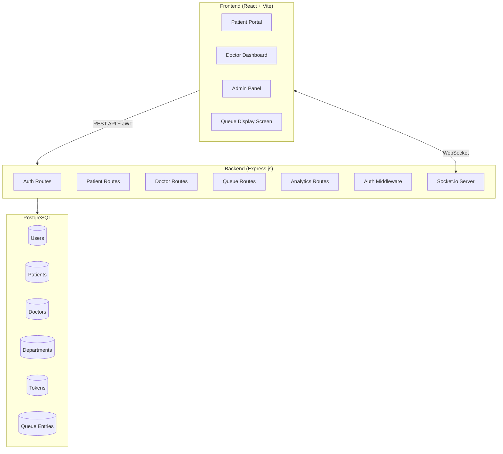
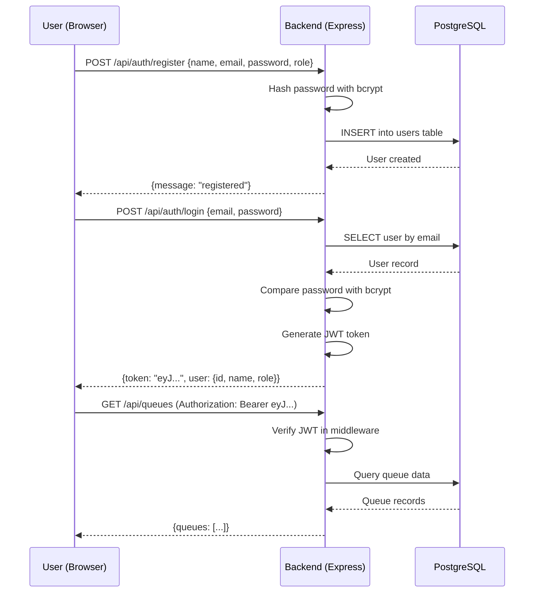
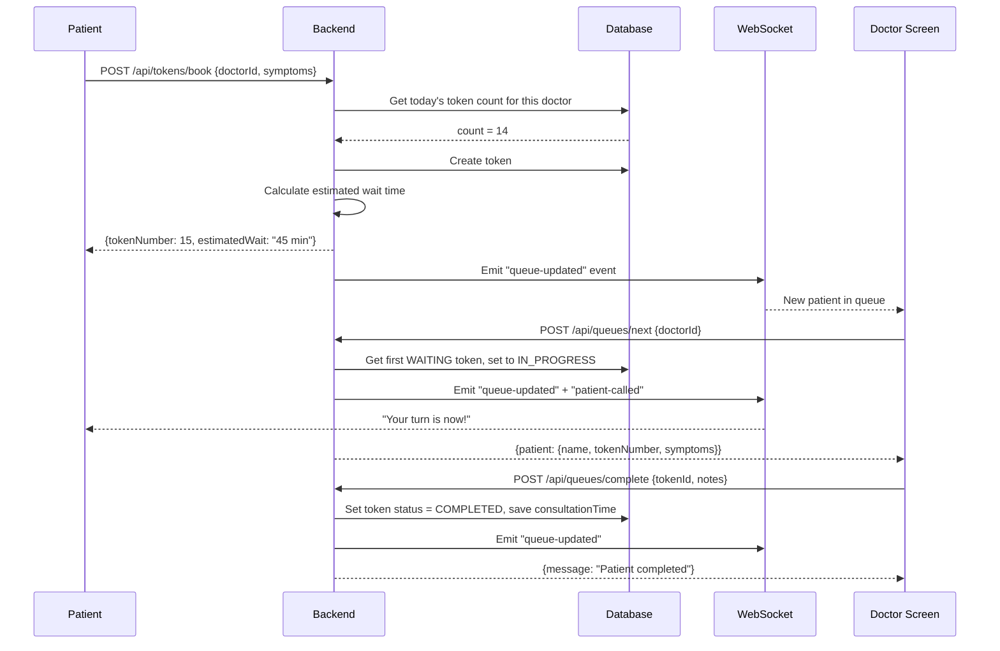
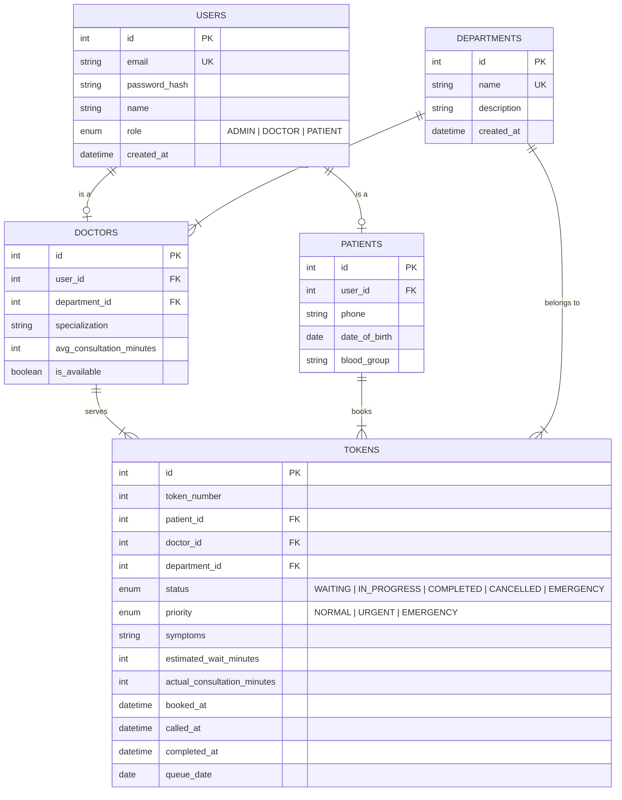

# Smart Hospital Queue Management System — Complete Roadmap

> [!IMPORTANT]
> **Read this document top-to-bottom once before you start building.** Then use the Day-by-Day roadmap (Part 6) as your daily guide. Come back to other sections only when the roadmap tells you to.

---

# Part 1 — Final Project Scope

## Tier A — Must Build (Core — Without These It's Not a Project)

| # | Feature | Why Tier A | Effort | Resume Value | Interview Value |
|---|---------|-----------|--------|-------------|----------------|
| 1 | **Patient Registration** | Every hospital system starts here. Shows you can model real-world entities. | Low (2 hrs) | ★★★ | ★★★ |
| 2 | **Token Generation** | The core mechanic of the system. Sequential numbering per department per day. | Low (1.5 hrs) | ★★★★ | ★★★★ |
| 3 | **Doctor & Department Management** | Without doctors/departments, queues have no meaning. | Low (2 hrs) | ★★★ | ★★ |
| 4 | **Queue Display per Doctor** | The main screen everyone looks at. Proves real-time data flow works. | Medium (3 hrs) | ★★★★ | ★★★★ |
| 5 | **JWT Authentication** | Shows you understand security. Every backend job requires this. | Medium (3 hrs) | ★★★★★ | ★★★★★ |
| 6 | **Role-Based Access (Admin / Doctor / Patient)** | Shows you understand authorization, not just authentication. | Medium (2 hrs) | ★★★★★ | ★★★★★ |
| 7 | **Doctor Dashboard — See Upcoming Patients** | Proves the system is useful for actual doctors. Two-sided product thinking. | Medium (3 hrs) | ★★★★ | ★★★★ |
| 8 | **Patient Portal — Track Own Token** | Proves the system works for patients too. Full-stack completion. | Medium (2.5 hrs) | ★★★★ | ★★★ |

## Tier B — Resume Upgrades (Build These to Stand Out)

| # | Feature | Why Tier B | Effort | Resume Value | Interview Value |
|---|---------|-----------|--------|-------------|----------------|
| 9 | **Waiting Time Estimation** | The "smart" in Smart Queue. Uses avg consultation time × patients ahead. Not ML — just math. Makes the project 10x more interesting. | Medium (3 hrs) | ★★★★★ | ★★★★★ |
| 10 | **Emergency / Priority Patient Handling** | Shows you understand priority queues — a real data structure. Interviewers love this. | Medium (2.5 hrs) | ★★★★★ | ★★★★★ |
| 11 | **Live Queue Updates (WebSocket)** | Shows real-time engineering. Massive interview differentiator. Even a basic implementation is impressive. | Medium (3 hrs) | ★★★★★ | ★★★★★ |

## Tier C — Interview Wow Features (Build If Time Allows on Day 4)

| # | Feature | Why Tier C | Effort | Resume Value | Interview Value |
|---|---------|-----------|--------|-------------|----------------|
| 12 | **Notifications (Turn Is Near)** | Simple in-app notification when patient is 2 positions away. Shows event-driven thinking. | Low (1.5 hrs) | ★★★★ | ★★★★ |
| 13 | **Historical Analytics Dashboard** | Charts showing daily load, avg wait time, busiest hours. Makes the project look production-grade. | Medium (3 hrs) | ★★★★ | ★★★★★ |

## Tier D — Skip For Now

| Feature | Why Skip |
|---------|---------|
| SMS/Email Notifications | Requires third-party APIs (Twilio/SendGrid), costs money, adds complexity with no backend learning value |
| ML-Based Wait Prediction | Overkill for 4 days. Simple math-based estimation is more impressive to explain in interviews |
| Appointment Scheduling | Different product entirely. Muddies the queue management story |
| Multi-Hospital Support | Adds complexity everywhere for zero learning value |
| Payment Integration | Unrelated to queue management |
| Mobile App | Web is enough. Responsive design covers mobile |

---

# Part 2 — Technology Decisions

| Layer | Choice | Why |
|-------|--------|-----|
| **Backend** | **Node.js + Express.js** | Largest ecosystem. Most beginner tutorials. JavaScript everywhere (same language front and back). Express is minimal — you understand every line. |
| **Database** | **PostgreSQL + Prisma ORM** | PostgreSQL is the industry standard relational DB. Prisma generates type-safe queries from a schema file — you write the schema, Prisma writes the SQL. Eliminates 80% of database confusion. |
| **Frontend** | **React (via Vite)** | Industry standard. You probably already know some. Vite is fast and simple to set up. |
| **Authentication** | **JWT (JSON Web Tokens) + bcrypt** | Simple to implement. Teaches you how auth actually works under the hood. Every interviewer asks about JWT. |
| **Real-Time** | **Socket.io** | WebSocket library that handles all edge cases for you. 5 lines of code for live updates. |
| **API Style** | **REST** | Simpler than GraphQL. Universally understood. Every backend job expects REST knowledge. |
| **Deployment** | **Railway** | One-click deploy. Free tier. Hosts both your backend AND PostgreSQL. No DevOps knowledge needed. |
| **Frontend Hosting** | **Vercel** | Free. Automatic deploys from GitHub. Built for React. |

### Why NOT more complicated alternatives?

| Rejected | Why |
|----------|-----|
| Django/Flask | Python backend means learning two ecosystems. JS everywhere is simpler for 4 days. |
| MongoDB | NoSQL doesn't teach you relationships, joins, or foreign keys — the things interviewers actually ask about. |
| GraphQL | 3x more setup than REST. Learning curve is steep. Resume value is equal to REST for this project. |
| TypeScript | Adds a compilation step and type errors that slow beginners down. Use plain JavaScript. |
| Docker | Great skill but zero learning value for this project. Railway deploys without it. |
| Redis | Queue systems with Redis are cool but overkill. PostgreSQL handles everything we need. |

---

# Part 3 — Architecture

## High-Level Architecture



## Folder Structure

```
hospital-queue/
├── backend/
│   ├── prisma/
│   │   └── schema.prisma          # Database schema (single source of truth)
│   ├── src/
│   │   ├── server.js              # Entry point — starts Express + Socket.io
│   │   ├── routes/
│   │   │   ├── auth.js            # Login, register, token refresh
│   │   │   ├── patients.js        # Patient CRUD + token booking
│   │   │   ├── doctors.js         # Doctor CRUD + availability
│   │   │   ├── queues.js          # Queue status, next patient, complete
│   │   │   └── analytics.js       # Historical data endpoints
│   │   ├── middleware/
│   │   │   ├── auth.js            # JWT verification middleware
│   │   │   └── roleCheck.js       # Role-based access control
│   │   ├── services/
│   │   │   ├── queueService.js    # Queue logic (priority, ordering)
│   │   │   ├── tokenService.js    # Token generation logic
│   │   │   └── waitTimeService.js # Waiting time estimation
│   │   ├── socket/
│   │   │   └── index.js           # Socket.io event handlers
│   │   └── utils/
│   │       └── helpers.js         # Shared utility functions
│   ├── .env                       # Environment variables (NEVER commit this)
│   ├── package.json
│   └── seed.js                    # Script to populate DB with test data
├── frontend/
│   ├── src/
│   │   ├── components/
│   │   │   ├── QueueDisplay.jsx
│   │   │   ├── PatientPortal.jsx
│   │   │   ├── DoctorDashboard.jsx
│   │   │   ├── AdminPanel.jsx
│   │   │   ├── Login.jsx
│   │   │   └── Navbar.jsx
│   │   ├── services/
│   │   │   ├── api.js             # Axios instance with JWT headers
│   │   │   └── socket.js          # Socket.io client setup
│   │   ├── context/
│   │   │   └── AuthContext.jsx    # React context for auth state
│   │   ├── App.jsx
│   │   └── main.jsx
│   ├── package.json
│   └── vite.config.js
├── README.md
└── .gitignore
```

## How Data Flows

### Authentication Flow


### Queue Management Flow


---

# Part 4 — Database Design

## Entity Relationship Diagram



## Table Details

### 1. `users` — Create FIRST
**Why it exists**: Single table for all user types. One login system for admins, doctors, and patients.
**What problem it solves**: Without this, you'd need separate login systems for each role — a nightmare.

| Field | Type | Notes |
|-------|------|-------|
| id | Int, Auto-increment | Primary key |
| email | String, Unique | Login identifier |
| password_hash | String | bcrypt hashed, NEVER store plain passwords |
| name | String | Display name |
| role | Enum: ADMIN, DOCTOR, PATIENT | Controls what they can access |
| created_at | DateTime | Auto-set on creation |

### 2. `departments` — Create SECOND
**Why it exists**: Hospitals are organized by departments (Cardiology, Orthopedics, etc.). Queues are per-doctor but doctors belong to departments.
**What problem it solves**: Groups doctors logically. Enables "show all queues in Cardiology."

| Field | Type | Notes |
|-------|------|-------|
| id | Int, Auto-increment | Primary key |
| name | String, Unique | e.g., "Cardiology" |
| description | String, Optional | Short description |

### 3. `doctors` — Create THIRD
**Why it exists**: Extends the user with doctor-specific data. A doctor IS a user (has login) PLUS specialization, department, and consultation time.
**What problem it solves**: Separates doctor-specific fields from generic user fields. Clean design.

| Field | Type | Notes |
|-------|------|-------|
| id | Int, Auto-increment | Primary key |
| user_id | Int, FK → users.id | Links to their login account |
| department_id | Int, FK → departments.id | Which department they belong to |
| specialization | String | e.g., "Pediatric Cardiology" |
| avg_consultation_minutes | Int, Default: 15 | Used for wait time calculation |
| is_available | Boolean, Default: true | Can they accept patients right now? |

### 4. `patients` — Create FOURTH
**Why it exists**: Extends the user with patient-specific data.
**What problem it solves**: Stores medical info that only patients have.

| Field | Type | Notes |
|-------|------|-------|
| id | Int, Auto-increment | Primary key |
| user_id | Int, FK → users.id | Links to their login account |
| phone | String, Optional | Contact number |
| date_of_birth | Date, Optional | For medical records |
| blood_group | String, Optional | Basic medical info |

### 5. `tokens` — Create FIFTH (This is the HEART of the system)
**Why it exists**: Every patient visit generates a token. This IS the queue. The token tracks the patient's journey from booking → waiting → in-progress → completed.
**What problem it solves**: Everything. Queue order, wait times, analytics, history.

| Field | Type | Notes |
|-------|------|-------|
| id | Int, Auto-increment | Primary key |
| token_number | Int | Sequential per doctor per day (e.g., 1, 2, 3...) |
| patient_id | Int, FK → patients.id | Who booked this token |
| doctor_id | Int, FK → doctors.id | Which doctor |
| department_id | Int, FK → departments.id | Which department (denormalized for easy querying) |
| status | Enum | WAITING, IN_PROGRESS, COMPLETED, CANCELLED |
| priority | Enum | NORMAL, URGENT, EMERGENCY |
| symptoms | String | Brief description from patient |
| estimated_wait_minutes | Int | Calculated at booking time |
| actual_consultation_minutes | Int, Nullable | Filled when consultation completes |
| booked_at | DateTime | When token was created |
| called_at | DateTime, Nullable | When doctor called this patient |
| completed_at | DateTime, Nullable | When consultation ended |
| queue_date | Date | Today's date — tokens reset daily |

> [!TIP]
> **Why `queue_date` matters**: Tokens reset every day. Token #1 on Monday is different from Token #1 on Tuesday. The `queue_date` field makes this work. Filter by `queue_date = TODAY` to get today's queue.

### Table Creation Order
1. `users` → No dependencies
2. `departments` → No dependencies
3. `doctors` → Depends on `users` + `departments`
4. `patients` → Depends on `users`
5. `tokens` → Depends on `patients` + `doctors` + `departments`

---

# Part 5 — API Design

## Authentication Endpoints (Build FIRST)

### POST `/api/auth/register`
**Purpose**: Create a new user account
```
Request:  { "name": "Rahul", "email": "rahul@email.com", "password": "secure123", "role": "PATIENT" }
Response: { "message": "Registration successful", "user": { "id": 1, "name": "Rahul", "role": "PATIENT" } }
Auth:     None (public)
```

### POST `/api/auth/login`
**Purpose**: Get a JWT token for an existing user
```
Request:  { "email": "rahul@email.com", "password": "secure123" }
Response: { "token": "eyJhbG...", "user": { "id": 1, "name": "Rahul", "role": "PATIENT" } }
Auth:     None (public)
```

### GET `/api/auth/me`
**Purpose**: Get current user's profile from their JWT
```
Request:  (none — JWT in header)
Response: { "id": 1, "name": "Rahul", "role": "PATIENT", "email": "rahul@email.com" }
Auth:     Any authenticated user
```

---

## Patient Endpoints (Build SECOND)

### POST `/api/patients/profile`
**Purpose**: Create/update patient profile (phone, DOB, blood group)
```
Request:  { "phone": "9876543210", "dateOfBirth": "2003-05-15", "bloodGroup": "O+" }
Response: { "id": 1, "userId": 1, "phone": "9876543210", ... }
Auth:     PATIENT only
```

### GET `/api/patients/my-tokens`
**Purpose**: Get all tokens for the logged-in patient (today + history)
```
Request:  (none)
Response: { "today": [{ tokenNumber: 3, doctor: "Dr. Shah", status: "WAITING", estimatedWait: 30 }], "history": [...] }
Auth:     PATIENT only
```

---

## Doctor Endpoints (Build THIRD)

### GET `/api/doctors`
**Purpose**: List all doctors (for patients to choose from)
```
Request:  (optional query: ?departmentId=1)
Response: { "doctors": [{ "id": 1, "name": "Dr. Shah", "department": "Cardiology", "specialization": "...", "isAvailable": true, "queueLength": 5 }] }
Auth:     Any authenticated user
```

### PATCH `/api/doctors/availability`
**Purpose**: Doctor toggles their availability
```
Request:  { "isAvailable": false }
Response: { "message": "Availability updated", "isAvailable": false }
Auth:     DOCTOR only
```

### GET `/api/doctors/my-queue`
**Purpose**: Doctor sees their current queue
```
Request:  (none)
Response: { "currentPatient": { tokenNumber: 3, name: "Rahul", symptoms: "chest pain" }, "upcoming": [...], "completed": 5, "remaining": 8 }
Auth:     DOCTOR only
```

---

## Department Endpoints

### GET `/api/departments`
**Purpose**: List all departments
```
Request:  (none)
Response: { "departments": [{ "id": 1, "name": "Cardiology", "doctorCount": 3, "totalWaiting": 12 }] }
Auth:     Any authenticated user
```

### POST `/api/departments`
**Purpose**: Create a new department
```
Request:  { "name": "Neurology", "description": "Brain and nerve disorders" }
Response: { "id": 4, "name": "Neurology" }
Auth:     ADMIN only
```

---

## Queue Endpoints (THE CORE — Build FOURTH)

### POST `/api/tokens/book`
**Purpose**: Patient books a token with a doctor
```
Request:  { "doctorId": 1, "symptoms": "persistent headache", "priority": "NORMAL" }
Response: { "tokenNumber": 7, "estimatedWaitMinutes": 45, "doctor": "Dr. Shah", "department": "Cardiology", "status": "WAITING" }
Auth:     PATIENT only
```

### POST `/api/queues/call-next`
**Purpose**: Doctor calls the next patient in their queue
```
Request:  (none — uses doctor's ID from JWT)
Response: { "token": { "tokenNumber": 4, "patient": { "name": "Rahul", "symptoms": "headache" } } }
Auth:     DOCTOR only
Side Effect: Emits WebSocket "queue-updated" + "patient-called" events
```

### POST `/api/queues/complete`
**Purpose**: Doctor marks current consultation as complete
```
Request:  { "tokenId": 15, "consultationMinutes": 12, "notes": "Prescribed paracetamol" }
Response: { "message": "Consultation completed", "nextPatient": { ... } or null }
Auth:     DOCTOR only
Side Effect: Emits WebSocket "queue-updated" event
```

### POST `/api/tokens/emergency`
**Purpose**: Admin/Doctor adds an emergency patient (jumps to front of queue)
```
Request:  { "patientId": 5, "doctorId": 1, "symptoms": "cardiac arrest", "priority": "EMERGENCY" }
Response: { "tokenNumber": "E1", "position": 1, "message": "Emergency patient added to front of queue" }
Auth:     ADMIN or DOCTOR
Side Effect: Emits WebSocket "emergency-alert" event
```

### GET `/api/queues/status/:doctorId`
**Purpose**: Get live queue status for a specific doctor
```
Request:  (none)
Response: { "doctor": "Dr. Shah", "currentToken": 4, "totalWaiting": 8, "estimatedTotalTime": "2h 15m", "queue": [{ tokenNumber: 5, status: "WAITING", estimatedWait: 15 }, ...] }
Auth:     Any authenticated user
```

### GET `/api/queues/display`
**Purpose**: Public queue display (for the TV screen in waiting room)
```
Request:  (optional query: ?departmentId=1)
Response: { "departments": [{ "name": "Cardiology", "doctors": [{ "name": "Dr. Shah", "currentToken": 4, "nextTokens": [5, 6, 7] }] }] }
Auth:     None (public) — This screen runs on a TV
```

---

## Analytics Endpoints (Build LAST)

### GET `/api/analytics/daily`
**Purpose**: Get today's statistics
```
Request:  (optional query: ?date=2026-06-09)
Response: { "totalPatients": 45, "completed": 32, "avgWaitMinutes": 28, "avgConsultationMinutes": 14, "busiestHour": "10:00-11:00", "departmentBreakdown": [...] }
Auth:     ADMIN or DOCTOR
```

### GET `/api/analytics/trends`
**Purpose**: Get weekly/monthly trends
```
Request:  (query: ?period=week)
Response: { "dailyLoads": [{ date: "2026-06-03", patients: 42 }, ...], "avgWaitTrend": [...] }
Auth:     ADMIN only
```

---

### API Build Order (Follow This Exactly)
1. **Auth** → register + login + me (everything else depends on this)
2. **Departments** → GET + POST (doctors need departments)
3. **Doctors** → GET + availability + my-queue
4. **Tokens** → book (the core action)
5. **Queues** → call-next + complete + status (makes the system functional)
6. **Patient** → my-tokens + profile
7. **Emergency** → emergency token
8. **Analytics** → daily + trends (last — depends on having data)

---

# Part 6 — Complete 4-Day Roadmap

---

## Day 1: Foundation + Authentication + First API

### Objective
By end of Day 1, you have a working backend with a database, user registration, login, JWT auth, and one protected route. You can register a user, log in, and get back a token.

### Tasks (In Exact Order)

| Time | Task | Details |
|------|------|---------|
| 0:00–0:15 | Install prerequisites | Node.js (LTS), VS Code, PostgreSQL (use [Neon.tech](https://neon.tech) free cloud DB to skip local install), Git |
| 0:15–0:25 | Create project structure | `mkdir hospital-queue && cd hospital-queue && mkdir backend frontend` |
| 0:25–0:35 | Initialize backend | `cd backend && npm init -y && npm install express prisma @prisma/client bcryptjs jsonwebtoken cors dotenv` |
| 0:35–0:40 | Initialize Git | `cd .. && git init && create .gitignore` (node_modules, .env, prisma/*.db) |
| 0:40–1:00 | Set up Prisma | `npx prisma init` → creates `prisma/schema.prisma` + `.env` |
| 1:00–1:30 | Write database schema | Open `schema.prisma`, define ALL 5 tables from Part 4 |
| 1:30–1:45 | Run first migration | `npx prisma migrate dev --name init` → creates tables |
| 1:45–2:00 | **BREAK** | Walk around. Drink water. You just set up a real database. |
| 2:00–2:30 | Create Express server | `src/server.js` — basic Express app with CORS, JSON parsing, one test route `GET /api/health` |
| 2:30–3:30 | Build auth routes | `src/routes/auth.js` — register (hash password, save user) + login (verify password, return JWT) |
| 3:30–4:00 | Build auth middleware | `src/middleware/auth.js` — extract JWT from header, verify, attach user to request |
| 4:00–4:15 | Build role middleware | `src/middleware/roleCheck.js` — check `req.user.role` against allowed roles |
| 4:15–4:30 | Build GET /api/auth/me | Protected route that returns current user — proves auth works |
| 4:30–5:00 | Test with REST client | Use VS Code "Thunder Client" extension or Postman. Register → Login → Use token → Hit /me |
| 5:00–5:15 | Build department routes | `POST /api/departments` (admin only) + `GET /api/departments` (any user) |
| 5:15–5:30 | Create seed script | `seed.js` — creates 1 admin, 3 departments, 4 doctors with test data |
| 5:30–5:45 | **Git commit** | `git add . && git commit -m "Day 1: Auth + departments + seed data"` |
| 5:45–6:00 | Review what you built | Open Prisma Studio (`npx prisma studio`) — see your data in a GUI |

### Expected Result
- ✅ Backend runs on `localhost:3000`
- ✅ PostgreSQL has 5 tables
- ✅ Can register users with different roles
- ✅ Can login and receive JWT
- ✅ Protected routes reject unauthenticated requests
- ✅ Departments exist with seed data
- ✅ Git has first commit

### Common Mistakes
| Mistake | Fix |
|---------|-----|
| Forgetting to add `.env` to `.gitignore` | Do this FIRST before committing |
| Storing plain passwords | Always use `bcryptjs.hash()` |
| JWT secret too short | Use at least 32 random characters |
| Not sending JWT in header | Format: `Authorization: Bearer <token>` |
| Prisma client not regenerating | Run `npx prisma generate` after schema changes |

### Stop Point
**STOP when you can**: Register → Login → Get token → Hit a protected endpoint → See your user data come back. Do NOT start on Day 2 tasks tonight.

---

## Day 2: Queue System + Token Logic + Doctor Dashboard

### Objective
By end of Day 2, the core queue system works. Patients can book tokens, doctors can call the next patient and complete consultations. The queue has real ordering.

### Tasks (In Exact Order)

| Time | Task | Details |
|------|------|---------|
| 0:00–0:15 | Review Day 1 code | Read through your auth code. Make sure you understand it. |
| 0:15–0:45 | Build doctor routes | `GET /api/doctors` (list all) + `PATCH /api/doctors/availability` |
| 0:45–1:30 | Build token booking | `POST /api/tokens/book` — this is the CORE feature. Generate token number (count today's tokens for this doctor + 1). Calculate estimated wait. |
| 1:30–2:00 | Build token service | `src/services/tokenService.js` — logic for generating token numbers, calculating position |
| 2:00–2:15 | **BREAK** | |
| 2:15–3:00 | Build wait time service | `src/services/waitTimeService.js` — `estimatedWait = patientsAhead × doctor.avgConsultationMinutes`. Simple but powerful. |
| 3:00–3:45 | Build queue routes | `POST /api/queues/call-next` — find first WAITING token for this doctor, set to IN_PROGRESS. `POST /api/queues/complete` — set IN_PROGRESS to COMPLETED, record consultation time. |
| 3:45–4:15 | Build queue status | `GET /api/queues/status/:doctorId` — returns current token, waiting list, estimated times |
| 4:15–4:45 | Build queue display | `GET /api/queues/display` — public endpoint showing all departments and current tokens |
| 4:45–5:15 | Build patient endpoints | `GET /api/patients/my-tokens` + `POST /api/patients/profile` |
| 5:15–5:45 | Test the full flow | Register patient → Book token → Login as doctor → Call next → Complete → Check status |
| 5:45–6:00 | Update seed script | Add sample tokens so queue isn't empty for testing |
| 6:00–6:10 | **Git commit** | `git commit -m "Day 2: Queue system + token booking + doctor workflow"` |

### Expected Result
- ✅ Patients can book tokens with any available doctor
- ✅ Token numbers auto-increment per doctor per day
- ✅ Wait time is calculated and returned
- ✅ Doctors can call next patient
- ✅ Doctors can complete consultations
- ✅ Queue status endpoint shows real-time queue state
- ✅ Patients can see their token status

### Common Mistakes
| Mistake | Fix |
|---------|-----|
| Token numbers not resetting daily | Filter by `queue_date = today` |
| Not handling "no waiting patients" | Return `null` or message when queue is empty |
| Calling next when already serving someone | Check if doctor has an IN_PROGRESS token first |
| Wrong wait time calculation | `position × avgConsultationMinutes` where position = number of WAITING tokens ahead |

### Stop Point
**STOP when you can**: Book a token → See it in queue → Call next as doctor → Complete consultation → See queue update. This is the core product. It works.

---

## Day 3: Priority Queue + WebSocket + Frontend Start

### Objective
By end of Day 3, emergency patients jump the queue, live updates work via WebSocket, and you have a basic React frontend that talks to your backend.

### Tasks (In Exact Order)

| Time | Task | Details |
|------|------|---------|
| 0:00–0:45 | Build emergency handling | `POST /api/tokens/emergency` — creates token with priority EMERGENCY. Modify queue ordering: `ORDER BY priority DESC, booked_at ASC`. Emergency patients go first. |
| 0:45–1:15 | Update wait time for priority | Recalculate wait times when emergency patient is added (everyone else waits longer) |
| 1:15–1:45 | Install + configure Socket.io | `npm install socket.io` on backend, create `src/socket/index.js`. Attach to Express server. |
| 1:45–2:15 | Add WebSocket events | Emit `queue-updated` on: token booked, call-next, complete, emergency. Emit `patient-called` when specific patient is called. |
| 2:15–2:30 | **BREAK** | |
| 2:30–2:45 | Initialize React frontend | `cd frontend && npm create vite@latest . -- --template react && npm install` |
| 2:45–3:00 | Install frontend dependencies | `npm install axios react-router-dom socket.io-client` |
| 3:00–3:30 | Set up API service | `src/services/api.js` — Axios instance with base URL + JWT interceptor |
| 3:30–3:45 | Set up Auth context | `src/context/AuthContext.jsx` — store JWT + user in React context |
| 3:45–4:15 | Build Login page | Simple form → calls `/api/auth/login` → stores JWT → redirects |
| 4:15–4:45 | Build Register page | Form with name, email, password, role select → calls `/api/auth/register` |
| 4:45–5:30 | Build Queue Display page | Fetch `/api/queues/display` → show departments, doctors, current tokens. Connect Socket.io → auto-refresh on `queue-updated`. |
| 5:30–6:00 | Build Patient Portal page | Show "my tokens" → token status, position, estimated wait time |
| 6:00–6:15 | Build Doctor Dashboard page | Show "my queue" → current patient, upcoming list, call-next button, complete button |
| 6:15–6:30 | Set up React Router | Routes: `/login`, `/register`, `/queue-display`, `/patient`, `/doctor`, `/admin` |
| 6:30–6:40 | **Git commit** | `git commit -m "Day 3: Priority queue + WebSocket + React frontend"` |

### Expected Result
- ✅ Emergency patients jump to front of queue
- ✅ Queue updates push to all connected browsers in real-time
- ✅ React frontend can register, login, display queue
- ✅ Patient can see their token status in browser
- ✅ Doctor can call-next and complete from browser
- ✅ Queue display auto-updates without page refresh

### Common Mistakes
| Mistake | Fix |
|---------|-----|
| CORS errors from React to Express | Add `cors({ origin: "http://localhost:5173" })` to Express |
| Socket.io not connecting | Use same port as Express. Make sure you pass the HTTP server to Socket.io, not the Express app. |
| JWT not sent with requests | Set up Axios interceptor: `config.headers.Authorization = Bearer ${token}` |
| React re-rendering too much | Use `useEffect` with proper dependency arrays |

### Stop Point
**STOP when**: You can open two browser tabs. Book a token in one. See it appear in real-time on the other. Doctor can call and complete patients from the UI.

---

## Day 4: Polish + Analytics + Deploy + Documentation

### Objective
By end of Day 4, the project is deployed, documented, and ready for your resume. Analytics work. The UI looks presentable.

### Tasks (In Exact Order)

| Time | Task | Details |
|------|------|---------|
| 0:00–0:30 | Build notifications | When patient is 2 positions away, show an in-app alert. Use Socket.io `patient-approaching` event. |
| 0:30–1:30 | Build analytics endpoints | `GET /api/analytics/daily` — query completed tokens, calculate averages. `GET /api/analytics/trends` — group by date for last 7 days. |
| 1:30–2:15 | Build analytics dashboard | Frontend page with simple stats: total patients today, avg wait, avg consultation time. Use a chart library (install `recharts`). |
| 2:15–2:30 | **BREAK** | |
| 2:30–3:00 | Build admin panel | List doctors, departments, add new ones. Simple CRUD. |
| 3:00–3:30 | UI Polish | Add a CSS framework (install `@picocss/pico` — minimal, beautiful, zero config). Add loading states. Add error messages. |
| 3:30–4:00 | Write seed script v2 | Generate 50+ realistic tokens across different doctors, departments, days. This makes analytics and demos look real. |
| 4:00–4:30 | Write README.md | Project description, features, tech stack, setup instructions, screenshots, API docs. Copy the template from Part 13. |
| 4:30–5:00 | Deploy backend to Railway | Push to GitHub → Connect Railway → Add environment variables → Deploy |
| 5:00–5:20 | Deploy frontend to Vercel | Connect GitHub repo → Set `VITE_API_URL` to Railway URL → Deploy |
| 5:20–5:40 | Test deployed version | Register → Login → Book token → Full flow on live URL |
| 5:40–5:50 | **Git commit + push** | Final commit with everything |
| 5:50–6:00 | Take screenshots | Capture queue display, doctor dashboard, patient portal, analytics. Save for README. |

### Expected Result
- ✅ Project is LIVE at a public URL
- ✅ Analytics show meaningful charts
- ✅ Notifications work when turn is near
- ✅ Admin can manage doctors/departments
- ✅ README is professional with screenshots
- ✅ Code is on GitHub
- ✅ Project is resume-ready

### Common Mistakes
| Mistake | Fix |
|---------|-----|
| Forgetting environment variables on Railway | Set DATABASE_URL, JWT_SECRET, PORT in Railway dashboard |
| Frontend calling localhost in production | Use `VITE_API_URL` env variable, not hardcoded URL |
| No seed data in production | Run seed script after deployment |
| README has no screenshots | Take them BEFORE you submit |

### Stop Point
**DONE.** Open the live URL. Walk through the full flow. If it works, you have a resume-ready project.

---

# Part 7 — Tiny Task Breakdown

> [!TIP]
> **How to use this**: Work through tasks sequentially. Check each one off. Never skip ahead. If you finish a task in 2 minutes, great. Move to the next one. The goal is momentum.

## Day 1 Tasks

| # | Task | Difficulty | Time | Depends On | You or AI? |
|---|------|-----------|------|-----------|------------|
| 1 | Install Node.js LTS from nodejs.org | Easy | 5 min | Nothing | You |
| 2 | Verify install: `node --version` and `npm --version` | Easy | 1 min | Task 1 | You |
| 3 | Sign up for free PostgreSQL at [neon.tech](https://neon.tech) | Easy | 5 min | Nothing | You |
| 4 | Copy your database connection string from Neon dashboard | Easy | 2 min | Task 3 | You |
| 5 | Create folder: `mkdir hospital-queue && cd hospital-queue` | Easy | 1 min | Nothing | You |
| 6 | Create subfolders: `mkdir backend frontend` | Easy | 1 min | Task 5 | You |
| 7 | Init Git: `git init` | Easy | 1 min | Task 5 | You |
| 8 | Create `.gitignore` with `node_modules`, `.env`, `prisma/migrations` | Easy | 2 min | Task 7 | You (type it) |
| 9 | `cd backend && npm init -y` | Easy | 1 min | Task 6 | You |
| 10 | Install backend deps: `npm install express @prisma/client bcryptjs jsonwebtoken cors dotenv` | Easy | 2 min | Task 9 | You |
| 11 | Install Prisma dev dep: `npm install -D prisma nodemon` | Easy | 1 min | Task 10 | You |
| 12 | Initialize Prisma: `npx prisma init` | Easy | 1 min | Task 11 | You |
| 13 | Open `.env`, paste your Neon database URL | Easy | 1 min | Task 4, 12 | You |
| 14 | Write the Prisma schema (all 5 models from Part 4) | Medium | 20 min | Task 12 | **You write it, AI reviews it** |
| 15 | Run migration: `npx prisma migrate dev --name init` | Easy | 2 min | Task 14 | You |
| 16 | Verify tables: `npx prisma studio` | Easy | 2 min | Task 15 | You |
| 17 | Create `src/server.js` with basic Express setup | Medium | 10 min | Task 10 | **You write it** |
| 18 | Add `GET /api/health` route that returns `{ status: "ok" }` | Easy | 5 min | Task 17 | You |
| 19 | Add `"dev": "nodemon src/server.js"` to package.json scripts | Easy | 2 min | Task 17 | You |
| 20 | Test: `npm run dev` → visit `localhost:3000/api/health` | Easy | 2 min | Task 18, 19 | You |
| 21 | Create `src/middleware/auth.js` — JWT verification | Medium | 15 min | Task 17 | **You type, AI explains** |
| 22 | Create `src/middleware/roleCheck.js` — role checking | Medium | 10 min | Task 21 | You |
| 23 | Create `src/routes/auth.js` — register endpoint | Medium | 20 min | Task 21 | **You write, AI helps with bcrypt** |
| 24 | Create `src/routes/auth.js` — login endpoint | Medium | 15 min | Task 23 | You (similar pattern) |
| 25 | Create `GET /api/auth/me` — protected route | Easy | 10 min | Task 24 | You |
| 26 | Install Thunder Client extension in VS Code | Easy | 2 min | Nothing | You |
| 27 | Test: Register a user via Thunder Client | Easy | 5 min | Task 23 | You |
| 28 | Test: Login and get JWT token | Easy | 5 min | Task 24, 27 | You |
| 29 | Test: Use JWT to hit `/api/auth/me` | Easy | 5 min | Task 25, 28 | You |
| 30 | Create `src/routes/departments.js` — CRUD | Easy | 15 min | Task 22 | You |
| 31 | Create `seed.js` — populate test data | Medium | 15 min | Task 30 | **AI helps generate realistic data** |
| 32 | Run seed: `node seed.js` → verify in Prisma Studio | Easy | 5 min | Task 31 | You |
| 33 | Git commit: `git add . && git commit -m "Day 1 complete"` | Easy | 2 min | Task 32 | You |

## Day 2 Tasks

| # | Task | Difficulty | Time | Depends On | You or AI? |
|---|------|-----------|------|-----------|------------|
| 34 | Create `src/routes/doctors.js` — GET all doctors | Easy | 15 min | Day 1 | You |
| 35 | Add query filter: `GET /api/doctors?departmentId=1` | Easy | 10 min | Task 34 | You |
| 36 | Create `PATCH /api/doctors/availability` | Easy | 10 min | Task 34 | You |
| 37 | Create `src/services/tokenService.js` | Medium | 20 min | Day 1 | **You write the logic, AI reviews** |
| 38 | Implement token number generation (count + 1 for today) | Medium | 15 min | Task 37 | You |
| 39 | Create `src/services/waitTimeService.js` | Medium | 15 min | Task 37 | **You write the formula** |
| 40 | Create `POST /api/tokens/book` | Hard | 30 min | Task 38, 39 | **You write, AI helps debug** |
| 41 | Test: Book 3 tokens for same doctor → verify sequential numbers | Easy | 10 min | Task 40 | You |
| 42 | Create `POST /api/queues/call-next` | Hard | 25 min | Task 40 | **You write, AI reviews** |
| 43 | Create `POST /api/queues/complete` | Medium | 20 min | Task 42 | You (similar pattern) |
| 44 | Create `GET /api/queues/status/:doctorId` | Medium | 15 min | Task 42 | You |
| 45 | Create `GET /api/queues/display` | Medium | 20 min | Task 44 | You |
| 46 | Create `GET /api/patients/my-tokens` | Easy | 15 min | Task 40 | You |
| 47 | Create `POST /api/patients/profile` | Easy | 10 min | Day 1 | You |
| 48 | Test full flow: Book → Call Next → Complete → Check Status | Easy | 15 min | Task 43 | You |
| 49 | Update seed script with sample tokens | Easy | 10 min | Task 40 | AI helps |
| 50 | Git commit | Easy | 2 min | Task 49 | You |

## Day 3 Tasks

| # | Task | Difficulty | Time | Depends On | You or AI? |
|---|------|-----------|------|-----------|------------|
| 51 | Create `POST /api/tokens/emergency` | Medium | 20 min | Day 2 | You |
| 52 | Update queue ordering: `ORDER BY priority DESC, booked_at ASC` | Medium | 15 min | Task 51 | **You think, AI validates SQL** |
| 53 | Recalculate wait times after emergency insert | Medium | 15 min | Task 52 | You |
| 54 | Test: Add emergency → verify it jumps queue | Easy | 10 min | Task 53 | You |
| 55 | Install Socket.io: `npm install socket.io` | Easy | 1 min | Day 2 | You |
| 56 | Create `src/socket/index.js` — Socket.io setup | Medium | 15 min | Task 55 | **AI explains, you type** |
| 57 | Attach Socket.io to Express server in `server.js` | Medium | 10 min | Task 56 | You |
| 58 | Emit `queue-updated` in book/call-next/complete routes | Medium | 15 min | Task 57 | You |
| 59 | Test: Open 2 browser tabs, verify events fire | Easy | 10 min | Task 58 | You |
| 60 | Init React: `cd frontend && npm create vite@latest . -- --template react` | Easy | 2 min | Nothing | You |
| 61 | Install frontend deps: `npm install axios react-router-dom socket.io-client` | Easy | 2 min | Task 60 | You |
| 62 | Create `src/services/api.js` — Axios with JWT interceptor | Medium | 10 min | Task 61 | **You write, AI explains interceptors** |
| 63 | Create `src/services/socket.js` — Socket.io client | Easy | 5 min | Task 61 | You |
| 64 | Create `src/context/AuthContext.jsx` | Medium | 15 min | Task 62 | **AI helps with React Context pattern** |
| 65 | Create Login page component | Medium | 20 min | Task 64 | You |
| 66 | Create Register page component | Easy | 15 min | Task 65 | You (copy Login pattern) |
| 67 | Set up React Router in `App.jsx` | Medium | 10 min | Task 65 | You |
| 68 | Create Queue Display page | Medium | 25 min | Task 63 | You |
| 69 | Add Socket.io listener to Queue Display (auto-refresh) | Medium | 10 min | Task 68 | You |
| 70 | Create Patient Portal page | Medium | 20 min | Task 64 | You |
| 71 | Create Doctor Dashboard page | Hard | 25 min | Task 64 | **You write, AI helps with button logic** |
| 72 | Add "Call Next" and "Complete" buttons that call backend | Medium | 15 min | Task 71 | You |
| 73 | Test full frontend flow in browser | Easy | 15 min | Task 72 | You |
| 74 | Git commit | Easy | 2 min | Task 73 | You |

## Day 4 Tasks

| # | Task | Difficulty | Time | Depends On | You or AI? |
|---|------|-----------|------|-----------|------------|
| 75 | Add "turn approaching" notification via Socket.io | Medium | 20 min | Day 3 | You |
| 76 | Create `GET /api/analytics/daily` | Medium | 25 min | Day 2 | **You write SQL aggregations, AI helps** |
| 77 | Create `GET /api/analytics/trends` | Medium | 20 min | Task 76 | You (similar pattern) |
| 78 | Install recharts: `npm install recharts` | Easy | 1 min | Day 3 | You |
| 79 | Build Analytics Dashboard page with charts | Medium | 30 min | Task 78 | **AI helps with Recharts config** |
| 80 | Build Admin Panel (list/add doctors, departments) | Medium | 25 min | Day 3 | You |
| 81 | Install Pico CSS: `npm install @picocss/pico` | Easy | 2 min | Day 3 | You |
| 82 | Apply styling to all pages | Medium | 20 min | Task 81 | You |
| 83 | Add loading states to all API calls | Easy | 15 min | Day 3 | You |
| 84 | Add error handling/messages to forms | Easy | 15 min | Day 3 | You |
| 85 | Enhance seed script with 50+ realistic tokens | Easy | 15 min | Task 76 | **AI generates data** |
| 86 | Write README.md | Medium | 25 min | Everything | **AI helps draft, you personalize** |
| 87 | Create GitHub repository | Easy | 5 min | Task 86 | You |
| 88 | Push to GitHub | Easy | 5 min | Task 87 | You |
| 89 | Sign up for [Railway](https://railway.app) | Easy | 5 min | Nothing | You |
| 90 | Deploy backend to Railway | Medium | 15 min | Task 88, 89 | **AI guides you through steps** |
| 91 | Add PostgreSQL addon on Railway | Easy | 5 min | Task 90 | You |
| 92 | Set environment variables on Railway | Easy | 5 min | Task 90 | You |
| 93 | Run seed on production | Easy | 5 min | Task 92 | You |
| 94 | Sign up for [Vercel](https://vercel.com) | Easy | 5 min | Nothing | You |
| 95 | Deploy frontend to Vercel | Easy | 10 min | Task 88, 94 | You |
| 96 | Set `VITE_API_URL` on Vercel | Easy | 2 min | Task 90, 95 | You |
| 97 | Test live deployment end-to-end | Easy | 10 min | Task 96 | You |
| 98 | Take screenshots for README | Easy | 5 min | Task 97 | You |
| 99 | Update README with screenshots + live URL | Easy | 10 min | Task 98 | You |
| 100 | Final git push | Easy | 2 min | Task 99 | You |

---

# Part 8 — Learning Guide

## REST APIs

**What it is**: A way to organize backend URLs so frontends can create, read, update, and delete data using HTTP methods (GET, POST, PUT, DELETE).

**Why it exists**: Without a standard pattern, every developer would invent their own URL scheme. REST is the convention everyone agreed on.

**Where it appears in this project**: Every route you build (`/api/auth/login`, `/api/tokens/book`, `/api/queues/status/:id`) follows REST patterns.

**What you need to know now**:
- `GET` = read data (list doctors, get queue status)
- `POST` = create data (register user, book token)
- `PATCH` = update part of data (toggle availability)
- `DELETE` = remove data
- Always return JSON
- Use proper status codes: 200 (ok), 201 (created), 400 (bad request), 401 (unauthorized), 404 (not found), 500 (server error)

**Safely ignore**: HATEOAS, content negotiation, REST maturity model levels.

---

## JWT (JSON Web Tokens)

**What it is**: A string that contains encrypted user info (`{id: 1, role: "DOCTOR"}`). The backend creates it at login. The frontend sends it with every request to prove who they are.

**Why it exists**: HTTP is stateless — the server doesn't remember who you are between requests. JWT solves this without sessions.

**Where it appears**: Login returns a JWT. Frontend stores it in localStorage. Every API request includes it in the `Authorization` header. Auth middleware decodes it.

**What you need to know now**:
- `jwt.sign(payload, secret, { expiresIn: '24h' })` — creates a token
- `jwt.verify(token, secret)` — decodes and validates a token
- Store the secret in `.env`, NEVER in code
- The token has 3 parts separated by dots: `header.payload.signature`

**Safely ignore**: Refresh tokens (for now), JWT vs sessions debate, token blacklisting.

---

## Middleware

**What it is**: A function that runs BEFORE your route handler. It can check things, modify the request, or reject it.

**Why it exists**: You don't want to copy-paste "check if user is logged in" in every single route. Middleware does it once.

**Where it appears**: `auth.js` middleware checks JWT. `roleCheck.js` middleware checks if user has the right role. CORS middleware allows cross-origin requests.

**What you need to know now**:
```javascript
// Middleware signature: (req, res, next) => { ... }
const auth = (req, res, next) => {
  const token = req.headers.authorization?.split(' ')[1];
  if (!token) return res.status(401).json({ error: 'No token' });
  const decoded = jwt.verify(token, process.env.JWT_SECRET);
  req.user = decoded;  // Attach user to request
  next();  // Pass to next middleware or route
};
```
- `next()` means "continue to the next step"
- Not calling `next()` means the request stops here

**Safely ignore**: Error-handling middleware (4 params), middleware ordering edge cases.

---

## Database Relationships

**What it is**: How tables connect to each other using foreign keys. A doctor "belongs to" a department. A token "belongs to" a patient AND a doctor.

**Why it exists**: Without relationships, you'd duplicate data everywhere. Instead of storing the doctor's name in every token, you store `doctor_id` and look it up.

**Where it appears**: The `tokens` table has `patient_id`, `doctor_id`, and `department_id` — all foreign keys.

**What you need to know now**:
- **One-to-Many**: One department has many doctors. One doctor has many tokens.
- **Foreign Key**: A column that points to another table's primary key.
- **Join**: Combining data from two tables. Prisma does this with `include: { doctor: true }`.

**Safely ignore**: Many-to-Many relationships, self-referential joins, composite keys.

---

## Authentication vs Authorization

**What it is**:
- **Authentication**: "Who are you?" → Login with email/password → Get JWT
- **Authorization**: "What can you do?" → Check role (ADMIN/DOCTOR/PATIENT)

**Where it appears**: Auth middleware handles authentication. Role middleware handles authorization.

**What you need to know now**: They are TWO SEPARATE STEPS. First verify the JWT (authentication), THEN check the role (authorization). Always in that order.

**Safely ignore**: OAuth, SSO, SAML, API keys.

---

## WebSockets (Socket.io)

**What it is**: A persistent two-way connection between browser and server. Unlike REST (browser asks, server responds), WebSockets let the server push data to the browser without being asked.

**Why it exists**: Queue displays need to update instantly when a patient is called. Without WebSockets, you'd have to refresh the page or poll every few seconds.

**Where it appears**: When a doctor calls the next patient, the server emits a `queue-updated` event. All browsers listening for that event instantly update.

**What you need to know now**:
```javascript
// Server: emit an event
io.emit('queue-updated', { doctorId: 1 });

// Client: listen for an event
socket.on('queue-updated', (data) => {
  refetchQueue();
});
```

**Safely ignore**: Rooms, namespaces, acknowledgements, sticky sessions.

---

## Environment Variables

**What it is**: Secret values stored in a `.env` file, NOT in your code. Things like database passwords, JWT secrets, API keys.

**Why it exists**: If you put secrets in code and push to GitHub, anyone can see them.

**Where it appears**: `.env` file in backend root. Accessed via `process.env.DATABASE_URL`.

**What you need to know now**:
- Create `.env` file in backend root
- Add `.env` to `.gitignore` IMMEDIATELY
- Use `dotenv` package: `require('dotenv').config()` at top of server.js
- On deployment (Railway), set these in the dashboard instead

**Safely ignore**: `.env.local` vs `.env.production`, dotenv-expand.

---

## Role-Based Access Control (RBAC)

**What it is**: Different users can do different things. Admins manage everything. Doctors manage their queue. Patients can only book and view.

**Where it appears**: The `roleCheck` middleware. Example: `router.post('/departments', auth, roleCheck(['ADMIN']), createDepartment)` — only admins can create departments.

**What you need to know now**:
```javascript
const roleCheck = (allowedRoles) => (req, res, next) => {
  if (!allowedRoles.includes(req.user.role)) {
    return res.status(403).json({ error: 'Access denied' });
  }
  next();
};
```

**Safely ignore**: Permission matrices, attribute-based access, policy engines.

---

# Part 9 — AI Usage Strategy

## Claude Opus 4 (Your Primary)

### Use For
- Understanding complex concepts you're stuck on
- Reviewing your code architecture ("Is this the right approach?")
- Debugging errors you've spent 10+ minutes on
- Writing the seed script with realistic data
- Drafting the README

### Do NOT Use For
- Writing every line of code (you won't learn)
- Simple syntax questions (Google these)
- Running commands (do those yourself)

### Typical Prompts
- "Review this Express route. Am I handling errors correctly? [paste 20-30 lines]"
- "I'm getting this error: [paste error]. Here's my code: [paste relevant file]. What's wrong?"
- "Explain how JWT middleware works in Express. Show a simple example."

### Frequency
3-5 times per day. Each conversation focused on ONE topic.

---

## Claude Sonnet

### Use For
- Code generation when you understand the pattern but want it faster
- Converting your pseudocode to real code
- Generating repetitive boilerplate (multiple similar routes)

### Do NOT Use For
- Core logic you need to understand (queue ordering, wait time calculation)
- Architecture decisions

### Typical Prompts
- "Convert this pseudocode to an Express route with Prisma: [pseudocode]"
- "I have this route for calling-next. Create a similar one for completing a consultation."

### Frequency
5-8 times per day. Short, focused requests.

---

## Claude Haiku

### Use For
- Quick syntax questions
- "How do I do X in JavaScript?"
- Formatting/linting questions
- Error message explanations

### Do NOT Use For
- Complex multi-file problems
- Architecture questions

### Typical Prompts
- "JavaScript: how to get today's date as YYYY-MM-DD?"
- "What does this Prisma error mean: [error]?"

### Frequency
As needed, 10-15 times per day. Cheap and fast.

---

## Gemini Pro

### Use For
- Alternative perspective when Claude's answer doesn't make sense
- Comparing approaches
- Searching for documentation links

### Do NOT Use For
- Primary coding (stick with Claude for consistency)

### Frequency
1-2 times per day, only when stuck.

---

## Cursor (IDE)

### Use For
- Inline code completion as you type
- Tab-complete for repetitive patterns
- Quick refactors

### Do NOT Use For
- Full feature implementation
- Understanding what code does

### How to Use
- Keep it on "autocomplete" mode
- Accept suggestions that match your intent
- Reject and type manually when learning something new

### Frequency
Always on. Accept ~40% of suggestions. Reject the rest.

---

## GitHub Copilot

### Use For
- Same as Cursor (use whichever one feels better)
- Writing comments that auto-generate code

### Pro Tip
Write a comment describing what you want FIRST, then let Copilot suggest the code. Read the suggestion. If you understand it, accept. If not, write it yourself.

### Frequency
Always on. Be selective about accepting.

---

# Part 10 — Token Optimization Plan

## The 7 Rules

### Rule 1: Try For 10 Minutes First
Before asking any AI, spend 10 minutes trying to solve it yourself. Read the error message. Check the Prisma docs. Google the error. 70% of the time, you'll fix it.

### Rule 2: One Question Per Message
Never ask "how do I set up auth AND how should I structure my database?" Split them. One topic. One message. Better answers, fewer tokens.

### Rule 3: Paste Only Relevant Code
Bad: Paste entire 200-line file
Good: Paste the 20-line function that's broken + the error message

### Rule 4: Use Haiku For Small Questions
Every time you're about to ask Opus "how to format a date in JS," stop. Use Haiku. Save Opus tokens for architecture and debugging.

### Rule 5: Don't Chat — Instruct
Bad: "Hey, I'm working on a hospital project and I need help with..."
Good: "Express.js route. Prisma. Get all tokens for today where doctorId=1, ordered by priority DESC then createdAt ASC. Return with patient name included."

### Rule 6: Never Continue A Dead Conversation
If a conversation has gone 10+ messages and you're going in circles, start fresh. Copy only the essential context into a new conversation.

### Rule 7: Use Copilot/Cursor For Boilerplate
Don't waste Claude tokens on import statements, basic CRUD, or simple React components. Let Copilot autocomplete those.

## Daily Token Budget Guide

| Model | Day 1 | Day 2 | Day 3 | Day 4 |
|-------|-------|-------|-------|-------|
| Opus | 3 conversations | 3 conversations | 4 conversations | 2 conversations |
| Sonnet | 5 requests | 7 requests | 8 requests | 5 requests |
| Haiku | Unlimited (cheap) | Unlimited | Unlimited | Unlimited |

## When To Ask AI vs When To NOT Ask

| Situation | Ask AI? | Instead Do |
|-----------|---------|------------|
| Error you've never seen | ✅ (after 10 min) | — |
| Forgot JavaScript syntax | ❌ | Google / MDN |
| Don't understand a concept | ✅ | — |
| Need boilerplate code | ❌ | Copilot/Cursor |
| Architecture question | ✅ | — |
| Prisma query syntax | ❌ | Prisma docs |
| Debugging a typo | ❌ | Read the error message |
| Code review | ✅ | — |
| "Should I do X or Y?" | ✅ (for complex choices) | — |
| Writing tests | ✅ (AI writes, you verify) | — |

---

# Part 11 — Prompt Library

## Backend Setup

```
Create an Express.js server with:
- CORS enabled for localhost:5173
- JSON body parsing
- A /api/health GET route returning { status: "ok" }
- Listening on PORT from .env or 3000
- Prisma client initialized
Use CommonJS (require/module.exports), not ES modules.
```

## JWT Authentication

```
Express.js middleware function that:
1. Extracts JWT from Authorization header (Bearer token format)
2. Verifies it using jwt.verify with process.env.JWT_SECRET
3. Attaches decoded payload to req.user
4. Returns 401 if no token or invalid token
5. Calls next() on success
Use jsonwebtoken package. CommonJS syntax.
```

## Database Query

```
Prisma query for [specific table]:
- Filter: [conditions]
- Include: [related tables]
- Order by: [fields]
- Return: [specific fields or all]
Give me just the Prisma query, not the full route.
```

## Queue Logic

```
Express route: POST /api/queues/call-next
- Get doctorId from req.user (JWT)
- Find the first token with status WAITING for this doctor today
- Order by: priority DESC (EMERGENCY first), then booked_at ASC
- Update its status to IN_PROGRESS and set called_at = now
- Return the token with patient info included
- If no waiting patients, return { message: "Queue empty" }
Use Prisma. Handle errors with try/catch.
```

## Wait Time Estimation

```
Function: calculateEstimatedWait(doctorId, prisma)
- Count WAITING tokens ahead of the new patient for this doctor today
- Get the doctor's avg_consultation_minutes
- Return: waitingAhead * avgConsultationMinutes
- If doctor has an IN_PROGRESS patient, subtract time already elapsed
Input: doctorId, prisma client
Output: { estimatedMinutes: number, position: number }
```

## Debugging

```
Error: [paste exact error message]
File: [filename]
Relevant code:
[paste 15-30 lines around the error]
Stack: Node.js, Express, Prisma, PostgreSQL
What's causing this and how do I fix it?
```

## Code Review

```
Review this Express route for:
1. Security issues
2. Error handling gaps
3. Edge cases
4. Prisma query efficiency
[paste code]
Only flag real problems. Don't suggest stylistic changes.
```

## React Component

```
React component: [ComponentName]
- Fetches data from: [API endpoint]
- Displays: [what to show]
- Uses: axios instance from services/api.js
- Auth: gets token from AuthContext
- Loading state: show "Loading..."
- Error state: show error message
Use functional component with hooks. No TypeScript.
```

## Deployment

```
I need to deploy:
- Backend: Express.js + Prisma + PostgreSQL to Railway
- Frontend: React (Vite) to Vercel
Backend repo is at: [GitHub URL]
What are the exact steps? Include environment variables I need to set.
```

## Interview Prep

```
I built a Hospital Queue Management System with:
- Node.js/Express backend
- PostgreSQL with Prisma
- JWT auth with RBAC
- Real-time updates with Socket.io
- Priority queue for emergencies
- Waiting time estimation
Give me 10 likely interview questions and strong answers.
Focus on: system design, database design, and technical decisions.
```

---

# Part 12 — Interview Preparation

## Likely Questions and Strong Answers

### 1. "Tell me about this project."

> "I built a smart queue management system for hospitals. It handles patient registration, token generation, real-time queue tracking, and waiting time estimation. The interesting parts are the priority queue for emergency patients, WebSocket-based live updates, and the waiting time prediction algorithm.
>
> The backend is Node.js with Express, PostgreSQL for the database with Prisma ORM, and Socket.io for real-time communication. There are three user roles — patients, doctors, and admins — each with different access levels using JWT authentication and role-based middleware."

### 2. "Why did you choose PostgreSQL over MongoDB?"

> "The data in this system is highly relational. Tokens belong to patients AND doctors. Doctors belong to departments. I needed foreign keys, joins, and transactional consistency — if a doctor calls the next patient, I need to atomically update the token status and emit a notification. PostgreSQL handles all of this natively. MongoDB would have forced me to denormalize everything and manage consistency in application code."

### 3. "How does the queue ordering work?"

> "Tokens are ordered by two fields: priority descending, then booking time ascending. Normal patients are served in FIFO order. When an emergency patient is added, they automatically move to the front because EMERGENCY priority sorts higher. I used Prisma's `orderBy: [{ priority: 'desc' }, { bookedAt: 'asc' }]` to handle this at the database level rather than sorting in application code."

### 4. "How do you calculate waiting time?"

> "It's a formula: `position × averageConsultationMinutes`. Position is the count of WAITING tokens ahead of the patient for that doctor today. The average consultation time is stored per doctor and updates as consultations are completed. If a doctor is currently seeing a patient, I subtract the elapsed time from the first slot. It's simple math but it gives surprisingly accurate estimates because consultation times are fairly consistent per doctor."

### 5. "How do real-time updates work?"

> "I use Socket.io, which maintains a persistent WebSocket connection between the browser and server. When key events happen — a token is booked, a patient is called, a consultation is completed — the server emits a `queue-updated` event. All connected clients listen for this event and refetch the queue data. The queue display in the waiting room updates instantly without page refresh."

### 6. "How does authentication work?"

> "Registration hashes the password with bcrypt and stores it. Login compares the plain password against the hash, and if it matches, generates a JWT containing the user's ID and role. The frontend stores this JWT in localStorage and sends it in the Authorization header with every request. A middleware function extracts and verifies the JWT, then attaches the decoded user to the request object. A second middleware checks the user's role against the route's allowed roles."

### 7. "What happens if two patients try to book the same token number simultaneously?"

> "Token numbers are generated by counting existing tokens for that doctor today and adding 1. In PostgreSQL, if two requests hit simultaneously, Prisma's `create` within a transaction ensures atomicity. In a production system with very high concurrency, I'd add a unique constraint on `(doctor_id, queue_date, token_number)` and handle the conflict with a retry. For a hospital with realistic traffic, the current approach works fine."

### 8. "How would you scale this system?"

> "First, I'd identify the bottleneck. Queue reads are far more frequent than writes, so I'd add Redis as a cache for queue status — cache invalidation happens on every write event, which we already track via Socket.io events. For the database, I'd add read replicas. For WebSockets at scale, I'd use Redis as a Socket.io adapter so multiple server instances share the same event bus. For the frontend, it's already static and can be served from a CDN."

### 9. "What's the hardest bug you faced?"

> *(Answer this honestly based on your actual experience building it. Good examples:)*
> - "The queue order was wrong when emergency patients were added — I was sorting in application code instead of the database query, which caused race conditions."
> - "Socket.io events weren't reaching the right clients because I wasn't using rooms properly."
> - "Token numbers were duplicating because I wasn't filtering by today's date."

### 10. "What would you add if you had more time?"

> "Three things: First, SMS notifications using Twilio when a patient's turn is 2 positions away — the event system is already in place, I just need to add the Twilio integration. Second, a more sophisticated waiting time model that accounts for the specific patient's symptoms (some conditions take longer). Third, appointment scheduling where patients can pre-book a time slot instead of walk-in only."

### 11. "Why not use a message queue like RabbitMQ for the queue system?"

> "The hospital queue is fundamentally different from a message queue. A message queue processes messages and removes them. A hospital queue needs to display status, allow re-ordering (emergency patients), track history, and calculate wait times. All of this requires the queue to live in a database where I can query, filter, and aggregate it. Socket.io handles the real-time notification part, which is the only overlap with a message queue."

### 12. "How do you handle if a doctor goes offline mid-day?"

> "The doctor can toggle their `isAvailable` flag. When set to false, no new tokens can be booked. Existing waiting patients can either wait or be reassigned. In the current version, they wait. In a production version, I'd add a bulk reassignment endpoint that moves all WAITING tokens to another doctor in the same department."

---

# Part 13 — Final Success Checklist

## ✅ Functionality Checklist

- [ ] Can register as Patient, Doctor, Admin
- [ ] Can login and receive JWT
- [ ] Protected routes reject unauthenticated requests
- [ ] Admin can create departments
- [ ] Admin can create/manage doctors
- [ ] Patient can book a token with a doctor
- [ ] Token numbers are sequential per doctor per day
- [ ] Wait time is displayed after booking
- [ ] Doctor can see their queue
- [ ] Doctor can call next patient
- [ ] Doctor can complete consultation
- [ ] Queue display shows all departments and current tokens
- [ ] Emergency patient jumps to front of queue
- [ ] Queue updates in real-time via WebSocket
- [ ] Patient portal shows their token status
- [ ] Notification appears when turn is near
- [ ] Analytics show today's statistics

## ✅ Backend Checklist

- [ ] All routes return proper status codes (200, 201, 400, 401, 403, 404, 500)
- [ ] All routes have error handling (try/catch)
- [ ] Passwords are hashed with bcrypt
- [ ] JWT secret is in .env
- [ ] CORS is configured
- [ ] Role-based access works for all routes
- [ ] Database has seed data for testing
- [ ] No hardcoded secrets in code

## ✅ GitHub Checklist

- [ ] Repository is public
- [ ] `.gitignore` includes: `node_modules`, `.env`, `dist`, `prisma/migrations` (optional to include migrations)
- [ ] No secrets committed (check with `git log --all -p | grep -i "password\|secret\|key"`)
- [ ] Meaningful commit messages (not "fix" or "update")
- [ ] At least 4 commits (one per day minimum)
- [ ] README.md exists and is complete

## ✅ Documentation Checklist (README.md Template)

```markdown
# 🏥 Smart Hospital Queue Management System

## Overview
A real-time queue management system for hospitals with patient 
token booking, live queue tracking, priority handling, 
and waiting time estimation.

## Features
- 🔐 JWT Authentication with Role-Based Access (Admin/Doctor/Patient)
- 🎫 Token Generation & Queue Management
- ⚡ Real-Time Queue Updates via WebSocket
- 🚨 Emergency Patient Priority Handling
- ⏱️ Smart Waiting Time Estimation
- 📊 Analytics Dashboard
- 🔔 Turn-Approaching Notifications

## Tech Stack
- **Backend**: Node.js, Express.js
- **Database**: PostgreSQL, Prisma ORM
- **Frontend**: React (Vite)
- **Real-Time**: Socket.io
- **Auth**: JWT + bcrypt

## Screenshots
[Add screenshots here]

## Setup

### Prerequisites
- Node.js 18+
- PostgreSQL database (or Neon.tech free tier)

### Backend
cd backend
npm install
cp .env.example .env    # Fill in your values
npx prisma migrate dev
node seed.js
npm run dev

### Frontend
cd frontend
npm install
npm run dev

## API Documentation
[Brief endpoint list or link to detailed docs]

## Architecture
[Paste the architecture diagram from Part 3]

## Live Demo
[Your Railway/Vercel URL here]

## Author
[Your name] — 3rd Year Engineering Student
Built as a learning project to understand backend development, 
database design, real-time systems, and authentication.
```

## ✅ Deployment Checklist

- [ ] Backend is deployed to Railway
- [ ] PostgreSQL addon is configured on Railway
- [ ] Environment variables are set on Railway
- [ ] Frontend is deployed to Vercel
- [ ] `VITE_API_URL` points to Railway URL on Vercel
- [ ] Live demo works end-to-end
- [ ] Seed data exists in production
- [ ] Live URL is in README

## ✅ Resume Checklist

Your resume bullet should look like this:

> **Smart Hospital Queue Management System** | Node.js, Express, PostgreSQL, React, Socket.io
> - Designed and built a full-stack queue system managing patient tokens, real-time queue updates, and doctor dashboards
> - Implemented JWT authentication with role-based access control (Admin/Doctor/Patient)
> - Built priority queue system with emergency handling and estimated wait time calculation
> - Integrated WebSocket (Socket.io) for live queue updates across all connected clients
> - Deployed on Railway (backend) and Vercel (frontend) with PostgreSQL database

- [ ] Project is listed on resume with correct tech stack
- [ ] GitHub link is included
- [ ] Live demo link is included
- [ ] You can explain every technical decision (review Part 12)
- [ ] You can draw the architecture on a whiteboard
- [ ] You can explain the database schema
- [ ] You can explain how auth works
- [ ] You can explain how the queue ordering works
- [ ] You can answer "how would you scale this?"

---

> [!IMPORTANT]
> **You're ready.** Follow Day 1 tasks tomorrow morning. Don't read ahead too much. Don't research more. Just start Task 1 and keep going. The roadmap has every decision made for you. Trust the plan.
